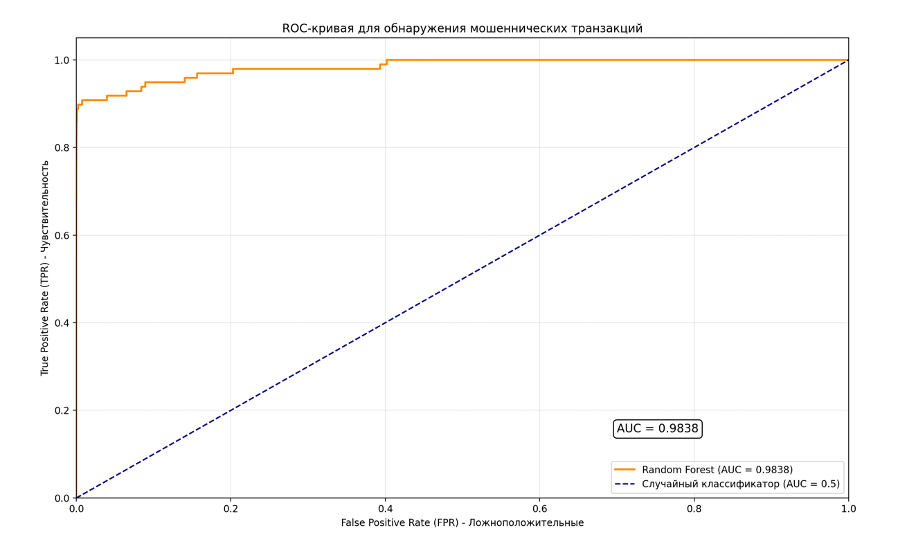
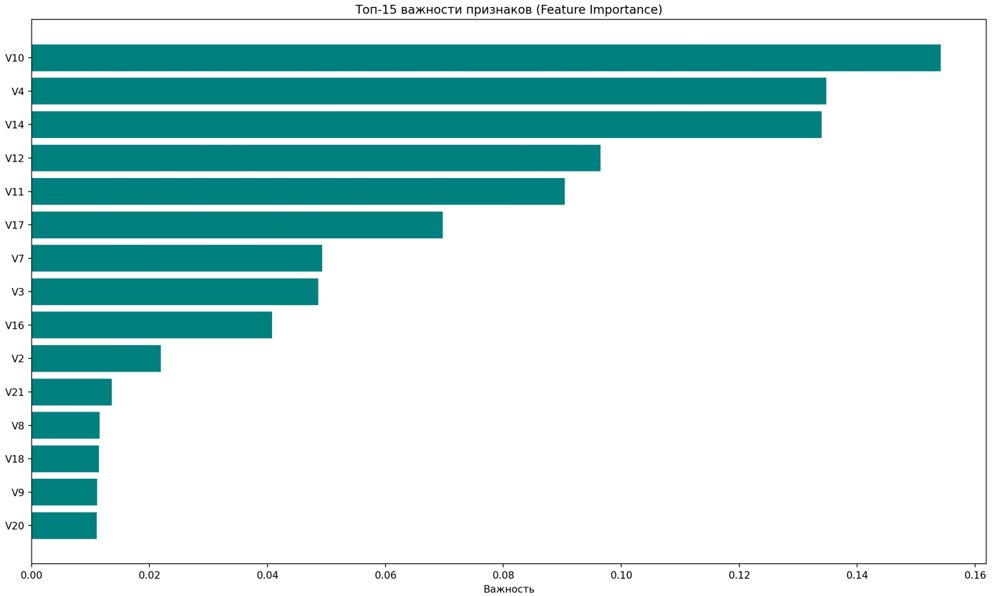

# Credit Card Fraud Detection

##  Описание проекта

Модель машинного обучения для обнаружения мошеннических транзакций в кредитных картах.  
Проект решает проблему **сильного дисбаланса классов** (0.17% мошеннических транзакций) с использованием классических ML-алгоритмов.

**Ключевая задача:** из 284k транзакций найти 492 мошеннические, минимизируя ложные срабатывания.

---

## Данные

- **Источник:** [Kaggle Credit Card Fraud Detection](https://www.kaggle.com/datasets/mlg-ulb/creditcardfraud)
- **Объем:** 284,807 транзакций, 31 признак
- **Особенности:**
  - Признаки V1-V28 получены с помощью PCA (анонимизированы)
  - Признаки `Time` и `Amount` не масштабированы
  - Сильный дисбаланс: 99.83% нормальных / 0.17% мошеннических

---

## Подход

### Feature Engineering
- Масштабирование `Amount` и `Time` с помощью `StandardScaler`
- Анализ корреляций и распределений

### Моделирование
| Модель | ROC-AUC | Recall |
|--------|---------|--------|
| Logistic Regression | 0.96 | 0.78 |
| Random Forest | **0.98** | **0.84** |
| XGBoost | 0.97 | 0.82 |

**Метрики**

ROC-AUC: 0.98 — модель отлично разделяет классы

Recall: 0.84 — найдено 84% всех мошеннических транзакций

Precision: 0.77 — из 100 предсказанных мошенников 77 реальные

**Финальная модель:** Random Forest с параметрами:
RandomForestClassifier(
    n_estimators=100,
    max_depth=10,
    min_samples_split=10,
    min_samples_leaf=5,
    class_weight='balanced',
    random_state=42
)
# Кривая ROC-AUC:

# Feature importance:

